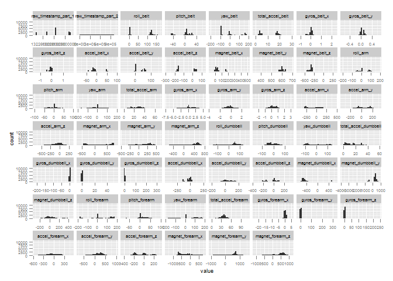
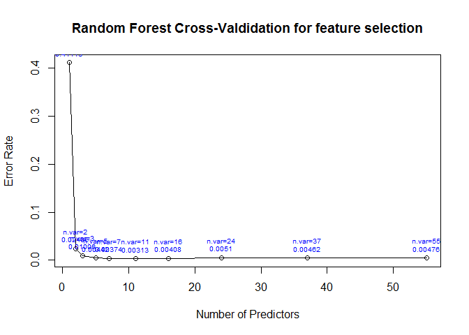

# Practical Machine Learning Assignment
Tina Palma  
Sunday, August 23, 2015  

#Data description

This human activity recognition research has traditionally focused on discriminating between different activities, i.e. to predict "which" activity was performed at a specific point in time (like with the Daily Living Activities dataset above). The approach they propose for the Weight Lifting Exercises dataset is to investigate "how (well)" an activity was performed by the wearer. The "how (well)" investigation has only received little attention so far, even though it potentially provides useful information for a large variety of applications,such as sports training.

Six young health participants were asked to perform one set of 10 repetitions of the Unilateral Dumbbell Biceps Curl in five different fashions: exactly according to the specification (Class A), throwing the elbows to the front (Class B), lifting the dumbbell only halfway (Class C), lowering the dumbbell only halfway (Class D) and throwing the hips to the front (Class E).

Class A corresponds to the specified execution of the exercise, while the other 4 classes correspond to common mistakes. Participants were supervised by an experienced weight lifter to make sure the execution complied to the manner they were supposed to simulate. The exercises were performed by six male participants aged between 20-28 years, with little weight lifting experience. We made sure that all participants could easily simulate the mistakes in a safe and controlled manner by using a relatively light dumbbell (1.25kg).

In this project, the goal will be to use data from accelerometers on the belt, forearm, arm, and dumbell of 6 participants. They were asked to perform barbell lifts correctly and incorrectly in 5 different ways. 

#Goal

The goal of this report is to built a predictive model with an out of sample error rate (estimate) to predict the manner in which they six partipants did the exercise (classes). 

The report explains all the steps followed including loading packages, data acquisition, data cleaning, preliminary data exploration, cross validation, model creation, model validation and out of sample error estimate and conclusion.

The goal of your project is to predict the manner in which they did the exercise. This is the "classe" variable in the training set. You may use any of the other variables to predict with. You should create a report describing how you built your model, how you used cross validation, what you think the expected out of sample error is, and why you made the choices you did. You will also use your prediction model to predict 20 different test cases. 

#Loading Packages
##Loading the libraries and dependent packages required across this work.


```r
library(caret)
```

```
## Loading required package: lattice
## Loading required package: ggplot2
```

```r
library(reshape2)
library(randomForest)
```

```
## randomForest 4.6-10
## Type rfNews() to see new features/changes/bug fixes.
```
#Data acquisition

##downloading training and testing data and checking its dimension

```r
#Downloading the dataset training and test from the web
#training
download.file(
        url = "http://d396qusza40orc.cloudfront.net/predmachlearn/pml-training.csv",
        destfile = "training.csv",mode="wb")
training <- read.csv("training.csv")

#testing
download.file(
        url = "http://d396qusza40orc.cloudfront.net/predmachlearn/pml-testing.csv",
        destfile = "testing.csv",mode="wb")
testing <- read.csv("testing.csv")

#checking the dimesion by using the function dim() in each dataset
dim(training)
```

```
## [1] 19622   160
```

```r
#dim testing
dim(testing)
```

```
## [1]  20 160
```

#Data Training and testing partition
##Data Partition

```r
#This is the "classe" variable in the training set.
set.seed(12345) 

#Create a partition of the training data and reverse 25% for validation
inTrain<-createDataPartition(y=training$classe,p=0.75,list=FALSE)

#Dedicate partition for training
train_training <-training[inTrain,]

#Dedicated partition for testing and validation
train_testing<-training[-inTrain,]

# showing dimensions of dataset
dim(train_training)
```

```
## [1] 14718   160
```

#Data cleaning
##Check the data NA values, empty row and useless information

```r
# removing all variables having NA
train_training <- train_training[,colSums(is.na(train_training))==0]

# showing dimensions of dataset
dim(train_training)
```

```
## [1] 14718    93
```

```r
# removing all variables with no value
train_training <- train_training[,colSums(train_training=="")==0]
# showing dimensions of dataset
dim(train_training)
```

```
## [1] 14718    60
```

```r
#removing all variables with no variability

train_training <- train_training[,nearZeroVar(train_training,saveMetrics = TRUE)$zeroVar + 
                       nearZeroVar(train_training,saveMetrics = TRUE)$nzv == 0]

dim(train_training)
```

```
## [1] 14718    59
```

```r
##Removing any variables that are obviously not playing any role to predict how weight lifting exercises are being performed.

train_training <- train_training[ , -which(names(train_training) %in% c("X","user_name","num_window","new_window"))] 

d <- melt(train_training[,-ncol(train_training)]) 
```

```
## Using cvtd_timestamp as id variables
```

```r
##Histogram plot
ggplot(d,aes(x = value)) + facet_wrap(~variable,scales = "free_x") + 
        geom_histogram() + theme(text = element_text(size=7))
```

```
## Warning in loop_apply(n, do.ply): position_stack requires constant width:
## output may be incorrect
```

 

##Comments
As per the histogram, you can see several kind of distribution's shape from completely multimodal to extremly skewed.   


#Model Creation and Validation 

I chose to use a random forest algorithm, so that it is not necessary to do any transformation of the variables. This algorithm should also pick first the most useful variables amongst the correlated ones.


```r
          # SUBSET TO TEST FULL RMD QUICKLY
          #subsampleindex<-createDataPartition(y=train_training$classe,p=0.1,list=FALSE)
          #train_training <- train_training[subsampleindex,]
          #train_training <- train_training[,c((ncol(train_training)-10):ncol(train_training))]

##training random forests with cross-validation for feature selection 

rfcvModel <- rfcv(trainx = train_training[,-ncol(train_training)],
                  trainy = train_training[,ncol(train_training)],cv.fold=2, 
                  scale="log", step=0.666)

##plotting the error rates by number of predictors used in each random forest
plot(rfcvModel$n.var,rfcvModel$error.cv,
     xlab = "Number of Predictors",
     ylab = "Error Rate", 
     main="Random Forest Cross-Valdidation for feature selection",
     type = "o")
     
text(rfcvModel$n.var,rfcvModel$error.cv,paste0("n.var=",rfcvModel$n.var,"\n",round(rfcvModel$error.cv,5)),cex=0.6,pos=3,col="blue")
```

 
Based on the above plot, 10 predictors already give a small error rate and going beyond 10 predictors does not bring large marginal accuracy improvement, so I opt for a random forest model with the top 10 most important predictors based on Gini values.


```r
##training a random forest
rfModel <- randomForest(classe~.,data=train_training)

##getting predictors with Gini importance values
important <- importance(rfModel, sort = TRUE)

##sorting predictors by importance
important <- important[order(important, decreasing=TRUE),,drop = FALSE]

##subsetting the 10 most important predictors
finaltrain <- train_training[,rownames(important)[1:10]]

##training a random forest model (with only the 10 most important predictors)
finalModel <- randomForest(train_training$classe ~., data=finaltrain)
```
#Model Accuracy Evaluation

The validation dataset is used to check the accuracy of the final model. This step is not critical as random forest algotithm has built in bootstrapping, since each tree is built with different resampling of the original (training) dataset and each node is built from a random subset of the potential remaining features, hence the technique actually yields an unbiased estimate of the test set error.


```r
##using the final model to predict on the validation dataset 
predictions <- predict(finalModel,train_testing)

##getting confusion matrix
cm <- confusionMatrix(predictions,train_testing$classe)

##showing confusion matrix
cm
```

```
## Confusion Matrix and Statistics
## 
##           Reference
## Prediction    A    B    C    D    E
##          A 1395    2    0    0    0
##          B    0  945    1    0    0
##          C    0    2  852    1    0
##          D    0    0    2  803    2
##          E    0    0    0    0  899
## 
## Overall Statistics
##                                          
##                Accuracy : 0.998          
##                  95% CI : (0.9963, 0.999)
##     No Information Rate : 0.2845         
##     P-Value [Acc > NIR] : < 2.2e-16      
##                                          
##                   Kappa : 0.9974         
##  Mcnemar's Test P-Value : NA             
## 
## Statistics by Class:
## 
##                      Class: A Class: B Class: C Class: D Class: E
## Sensitivity            1.0000   0.9958   0.9965   0.9988   0.9978
## Specificity            0.9994   0.9997   0.9993   0.9990   1.0000
## Pos Pred Value         0.9986   0.9989   0.9965   0.9950   1.0000
## Neg Pred Value         1.0000   0.9990   0.9993   0.9998   0.9995
## Prevalence             0.2845   0.1935   0.1743   0.1639   0.1837
## Detection Rate         0.2845   0.1927   0.1737   0.1637   0.1833
## Detection Prevalence   0.2849   0.1929   0.1743   0.1646   0.1833
## Balanced Accuracy      0.9997   0.9978   0.9979   0.9989   0.9989
```
#Conclusions and Evaluation on Testing Dataset

The final model's out of sample error estimate is lower than 5% with a relatively narrow 95% CI, so it is within the initially stated accuracy goal.


